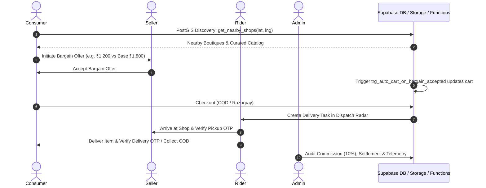
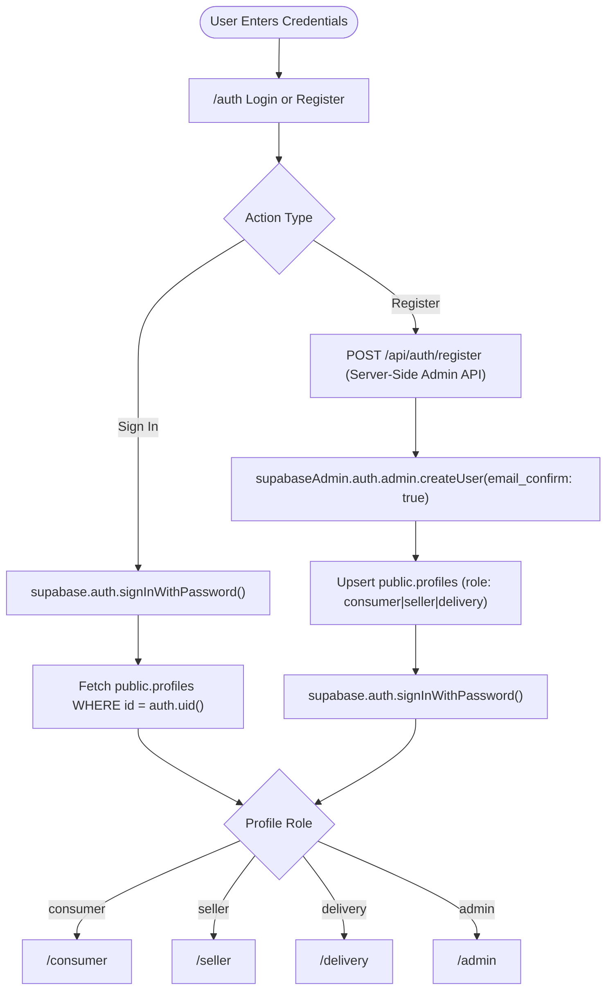
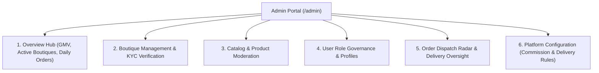
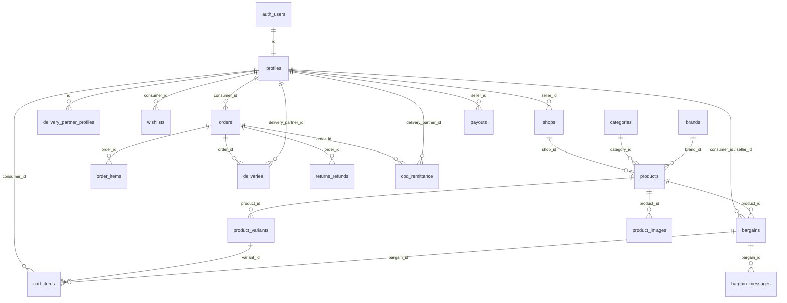
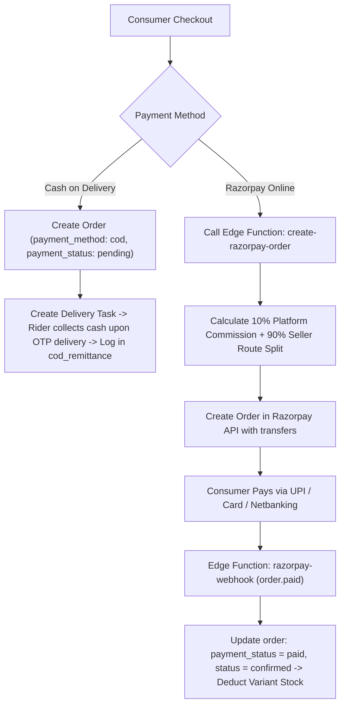
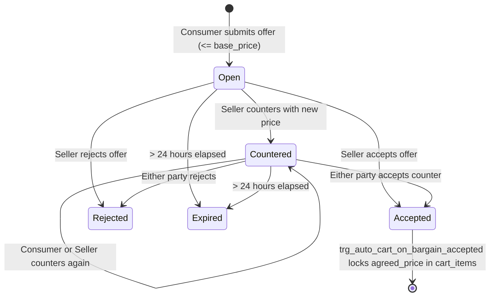
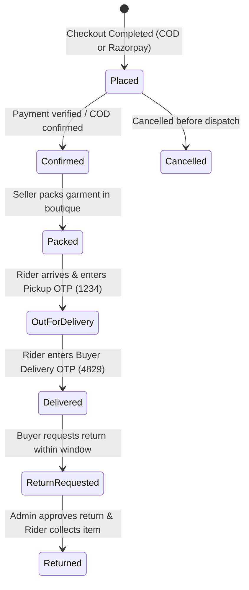

# PARIDHAN — Master Project Documentation

> **Single Source of Truth for Architecture, Schema, Roles, Workflows, and Implementation**  
> *Hyperlocal Fashion Marketplace with Direct Bargaining, PostGIS Local Discovery & Instant Delivery Dispatch*

---

## ⚡ QUICK CONTEXT FOR AI AGENTS (Read in < 60 Seconds)

- **What is PARIDHAN?**  
  A hyperlocal Indian fashion marketplace connecting consumers with nearby clothing boutiques and artisans. Key differentiators are **real-time direct price bargaining**, **PostGIS radius-based shop discovery**, and **OTP-verified local rider dispatch**.
- **Tech Stack**:  
  - **Web Client & Admin Suite**: Next.js 14 (App Router, TypeScript, Tailwind CSS, Lucide icons, Supabase SSR/Client).
  - **Mobile Client**: Flutter (Dart >=3.13, Riverpod state management, GoRouter, Google Fonts Outfit, Supabase Flutter SDK).
  - **Backend & Database**: Hosted Supabase (PostgreSQL 15+, PostGIS spatial extension, GoTrue Auth, Realtime, Storage, Edge Functions).
- **Database Location**: Hosted Supabase project ref `faqtswmhgintutwvnkyy` (`https://faqtswmhgintutwvnkyy.supabase.co`).
- **4 Core User Roles**: `consumer`, `seller`, `delivery`, `admin` (strictly isolated via database profiles, Next.js `RoleGuard`, and GoRouter navigation).
- **Frontends**:
  - `apps/admin`: Next.js 14 App Router multi-role web platform (`/auth`, `/consumer`, `/seller`, `/delivery`, `/admin`, `/api/auth/register`).
  - `apps/mobile`: Flutter multi-flavor client supporting Consumer, Seller, Rider, and Admin screens.
- **What is Already Implemented**:
  - Full 22-table database schema with PostGIS RPC `get_nearby_shops()`.
  - Database trigger `auto_cart_on_bargain_accepted` syncing agreed prices to shopping cart.
  - Server-side user registration API (`/api/auth/register`) bypassing SMTP rate limits with confirmed user creation.
  - Role-isolated web portals for all 4 roles in `apps/admin` (100% passing Next.js production build).
  - 4 Supabase Edge Functions (`create-razorpay-order`, `expire-stale-bargains`, `razorpay-webhook`, `send-push-notification`).
- **What Must NEVER Be Broken**:
  - Never drop or rename the 22 core tables without approval.
  - Never expose `SUPABASE_SERVICE_ROLE_KEY` in frontend bundles or `NEXT_PUBLIC_*`.
  - Never weaken `RoleGuard` or allow cross-role page access.
  - Never disable PostGIS spatial queries or the bargain-to-cart sync triggers.

---

## TABLE OF CONTENTS

1. [Project Overview](#1-project-overview)
2. [Product Vision](#2-product-vision)
3. [User Roles & Permissions](#3-user-roles--permissions)
4. [Authentication & Authorization](#4-authentication--authorization)
5. [Frontend Architecture](#5-frontend-architecture)
6. [Web Routes (apps/admin)](#6-web-routes-appsadmin)
7. [Consumer Experience](#7-consumer-experience)
8. [Seller Experience (Seller Studio)](#8-seller-experience-seller-studio)
9. [Delivery Experience (Fleet Radar)](#9-delivery-experience-fleet-radar)
10. [Admin Experience (Operations Hub)](#10-admin-experience-operations-hub)
11. [Database Architecture](#11-database-architecture)
12. [Database Tables (22 Core Tables)](#12-database-tables-22-core-tables)
13. [Database Relationships](#13-database-relationships)
14. [PostGIS Geospatial Engine](#14-postgis-geospatial-engine)
15. [Database Functions & Triggers](#15-database-functions--triggers)
16. [Row Level Security (RLS) & Security Posture](#16-row-level-security-rls--security-posture)
17. [Storage Buckets](#17-storage-buckets)
18. [Payments Architecture (Razorpay & COD)](#18-payments-architecture-razorpay--cod)
19. [Supabase Edge Functions](#19-supabase-edge-functions)
20. [Bargaining Engine](#20-bargaining-engine)
21. [Order Lifecycle & OTP Verification](#21-order-lifecycle--otp-verification)
22. [Mobile Application (Flutter)](#22-mobile-application-flutter)
23. [Admin Web Application (Next.js 14)](#23-admin-web-application-nextjs-14)
24. [UI & Design Systems](#24-ui--design-systems)
25. [Repository Project Structure](#25-repository-project-structure)
26. [Environment Variables](#26-environment-variables)
27. [Local Development & Build Guide](#27-local-development--build-guide)
28. [Verification & Testing Suite](#28-verification--testing-suite)
29. [Current Implementation Status Matrix](#29-current-implementation-status-matrix)
30. [Known Limitations & Security Notes](#30-known-limitations--security-notes)
31. [Future Roadmap (Current vs Planned)](#31-future-roadmap-current-vs-planned)
32. [Rules for Future AI Agents](#32-rules-for-future-ai-agents)

---

## 1. PROJECT OVERVIEW

- **Project Name**: PARIDHAN
- **Tagline**: *"Wear Local. Support Local."*
- **Project Type**: Hyperlocal Fashion Marketplace
- **Core Idea**: A local fashion marketplace connecting customers with nearby clothing boutiques, ethnic dressmakers, and artisan studios, offering real-time bargaining, local discovery, instant delivery, and role-based operations.

### Problem Being Solved
1. **Local Boutiques are Digitally Invisible**: Traditional clothing shops and custom artisans cannot compete with national e-commerce giants because cataloging is cumbersome and national logistics are too slow for instant local demand.
2. **Loss of the Indian Street Bargaining Culture**: Online fashion is rigid with non-negotiable prices, whereas Indian retail fashion thrives on negotiation, personal customer-seller rapport, and dynamic discounting.
3. **Slow Delivery in Fashion**: Standard e-commerce takes 3–7 days for delivery; PARIDHAN enables same-day, 60-to-180-minute hyperlocal delivery from shops within a 5–15 km radius.

### Target Users
- **Consumers (Buyers)**: Men and women seeking authentic local fashion, ethnic wear, wedding attire, and daily wear with immediate delivery and direct bargaining power.
- **Boutique Sellers**: Local shop owners, boutique designers, handloom weavers, and garment sellers wanting a digital storefront without high tech overhead.
- **Delivery Partners (Riders)**: Local motorcycle/scooter gig workers seeking flexible per-trip payouts and automated COD remittance.
- **Marketplace Admins**: Operations and city managers overseeing boutique KYC, dispute resolution, GMV metrics, and commission payouts.

### Main Differentiator
- **Interactive Real-Time Bargaining**: Buyers can make direct offers below base price; sellers can accept, reject, or counter-offer in real-time. Upon acceptance, a PostgreSQL trigger automatically locks the discounted price into the buyer's active shopping cart.
- **PostGIS Spatial Search**: Boutiques and inventory are filtered dynamically based on geographic distance from the customer's GPS coordinates.
- **Dual-OTP Delivery Handover**: Two-stage OTP verification (Pickup OTP from seller, Delivery OTP from consumer) ensures zero stolen goods and verified COD collection.

### High-Level Marketplace Workflow


---

## 2. PRODUCT VISION

PARIDHAN unifies four tailored stakeholder journeys into a single cohesive marketplace:

### 1. Consumer Journey
`Discover → Filter by Distance → Inspect Variants → Bargain in Real-Time → Add to Bag → Checkout → Track Live Rider → Handover via OTP`
- Explores nearby boutiques on a map or list.
- Explores editorial collections with size/color variants.
- Bargains with boutique owners; locks deal prices into the shopping bag.
- Pays via Cash on Delivery or Razorpay online payments.
- Tracks dispatch in real-time and confirms receipt using a 4-digit OTP.

### 2. Seller Journey
`Register Shop → Upload Catalog & Variants → Set Floor Prices → Negotiate Live Bargains → Accept Orders → Pack Garments → Handover to Rider`
- Manages boutique metadata, banner, operating address, and PostGIS location.
- Lists apparel items with multiple SKU variants, prices, and minimum acceptable bargain thresholds.
- Receives instant bargain alerts, responds with counter-offers or approvals.
- Manages order packing status and provides the Pickup OTP to the arriving rider.

### 3. Delivery Partner Journey
`Toggle Online Duty → View Dispatch Radar → Accept Nearby Trip → Navigate to Shop → Enter Pickup OTP → Transit to Buyer → Enter Delivery OTP → Remit COD`
- Toggles availability status on duty.
- Views orders waiting for pickup within immediate proximity.
- Receives distance, payout fee (e.g. ₹85), and customer location.
- Enters Seller's Pickup OTP (`1234`) to seal possession.
- Enters Buyer's Delivery OTP (`4829`) to finalize delivery and marks COD collected.

### 4. Admin Journey
`Platform Telemetry → Boutique KYC Verification → Catalog Oversight → Dispute Resolution → Config & Commission Management`
- Monitors Gross Merchandise Value (GMV), active riders, pending orders, and total boutiques.
- Reviews seller KYC documents (GST, PAN, shop photos) before granting verified status.
- Moderates catalog items and reviews flagged bargains or orders.
- Adjusts platform commission percentage (default 10%), base delivery rates, and feature flags.

---

## 3. USER ROLES & PERMISSIONS

PARIDHAN enforces four distinct roles defined by the `user_role` enum: `consumer`, `seller`, `delivery`, `admin`.

| Role | Primary Purpose | Default Route | Permitted Features | Data Access Scope | MUST NOT Access |
| :--- | :--- | :--- | :--- | :--- | :--- |
| **CONSUMER** | Browse, negotiate, and purchase local apparel | `/consumer` | PostGIS shop search, product browsing, bargain negotiation, shopping cart, checkout, order tracking, reviews | Own profile, own cart, own bargains, own orders, verified public shops/products | `/seller/*`, `/delivery/*`, `/admin/*` |
| **SELLER** | Manage boutique storefront, inventory, and orders | `/seller` | Shop profile setup, product/variant management, inventory stock adjustments, incoming bargain chats, order fulfillment queue | Own shop record, own products/variants, bargains for own shop, incoming orders for own shop | `/consumer/checkout`, `/delivery/*`, `/admin/*` |
| **DELIVERY** | Fulfill order transport and collect COD | `/delivery` | Online/offline duty toggle, dispatch radar, trip acceptance, OTP verification, earnings ledger, COD remittance | Assigned deliveries, pickup/drop coordinates, delivery partner profile, own COD records | `/seller/inventory`, `/consumer/cart`, `/admin/*` |
| **ADMIN** | Supervise platform operations and governance | `/admin` | Telemetry analytics, boutique KYC approval/rejection, user role management, platform fee config, catalog moderation | Full platform telemetry, all shops, all profiles, all orders, platform configuration | Restricted from creating personal consumer orders or bargain threads inside admin layout |

### Role Isolation Rules
1. **Frontend Isolation**: Next.js `RoleGuard` and GoRouter intercept every navigation. If an authenticated user with role `consumer` attempts to open `/seller`, `/delivery`, or `/admin`, they are instantly redirected to `/consumer`.
2. **Database Isolation**: The `public.profiles.role` column is the single source of truth for authorization. Public signup via `/api/auth/register` strictly forbids self-assigning the `admin` role.
3. **Route Guards**: Layout components in `apps/admin/app/[role]/layout.tsx` wrap all sub-pages with `<RoleGuard allowedRole="[role]">`.

---

## 4. AUTHENTICATION & AUTHORIZATION

### Architecture Overview
Authentication is powered by **Supabase Auth (GoTrue)** integrated with a custom `public.profiles` table.



### Key Components

1. **Authentication-First Architecture (`middleware.ts`)**:
   - The root path `/` automatically redirects unauthenticated users to `/auth`.
   - Next.js internals, static assets, and `/api` routes pass through untouched.

2. **Strict Profile Role Resolution (`authContext.tsx`)**:
   - On session establishment, the client fetches the authenticated user's profile from `public.profiles`.
   - The state exposes `{ user, profile, role, loading, signIn, signUp, signOut, refreshProfile }`.

3. **Server-Side Registration API (`/api/auth/register`)**:
   - Implemented in `apps/admin/app/api/auth/register/route.ts`.
   - Uses `SUPABASE_SERVICE_ROLE_KEY` on the server to create users with `email_confirm: true`.
   - Prevents registration stalls caused by unconfigured or rate-limited external SMTP servers.
   - Automatically validates role (restricting public registrations to `consumer`, `seller`, `delivery`).

4. **Client Role Guard (`RoleGuard.tsx`)**:
   - Checks `loading`, `user`, and `role`.
   - If unauthenticated → redirects to `/auth`.
   - If authenticated with a mismatched role → redirects to `getRoleHomeUrl(role)`.

5. **Cross-Role Protection Matrix**:
   - Consumer accessing `/seller/*` → Redirected to `/consumer`
   - Seller accessing `/consumer/*` → Redirected to `/seller`
   - Rider accessing `/admin/*` → Redirected to `/delivery`
   - Unauthenticated accessing any protected route → Redirected to `/auth`

---

## 5. FRONTEND ARCHITECTURE

The repository contains two production-ready frontend clients:

```
real_paridhan-main/
├── apps/
│   ├── admin/      # Next.js 14 Web Platform (All 4 User Portals + Admin)
│   └── mobile/     # Flutter Cross-Platform Mobile & Web Client
```

### 1. Web Platform (`apps/admin`)
- **Framework**: Next.js 14.2.23 (App Router)
- **Language**: TypeScript 5.7.3
- **Styling**: Tailwind CSS, CSS Modules, Lucide React icons
- **State & Auth**: React Context (`authContext.tsx`), Supabase JS SDK (`@supabase/supabase-js`, `@supabase/ssr`)
- **Purpose**: Unified responsive web application hosting all 4 role portals (Consumer Storefront, Seller Studio, Delivery Radar, and Super Admin Management).
- **Build Output**: 22 statically optimized and dynamic routes.

### 2. Mobile App (`apps/mobile`)
- **Framework**: Flutter 3.13+ (Dart SDK `>=3.13.0 <4.0.0`)
- **State Management**: Flutter Riverpod (`^3.4.3`)
- **Navigation**: GoRouter (`^18.0.1`)
- **Typography & UI**: Google Fonts Outfit (`^8.2.1`), Cupertino Icons, Material 3 Design
- **Backend SDK**: `supabase_flutter: ^2.17.2`
- **Flavors / Entrypoints**:
  - `lib/main.dart` — Multi-role dynamic router
  - `lib/main_consumer.dart` — Consumer-focused launcher
  - `lib/main_seller.dart` — Seller Studio launcher
  - `lib/main_delivery.dart` — Delivery Rider launcher

---

## 6. WEB ROUTES (apps/admin)

All routes are implemented using Next.js 14 App Router conventions under `apps/admin/app/`:

```
apps/admin/app/
├── layout.tsx                    # Root HTML layout with AuthProvider & Supabase listeners
├── page.tsx                      # Root index (redirects to /auth or role portal)
├── globals.css                   # Tailwind base, dark slate palette, custom variables
│
├── auth/
│   └── page.tsx                  # Sign In, Role-based Sign Up, Demo Credentials Switcher
│
├── api/
│   └── auth/
│       └── register/
│           └── route.ts          # Server-side confirmed user creation API
│
├── consumer/                     # CONSUMER PORTAL
│   ├── layout.tsx                # RoleGuard (allowedRole="consumer") + Header Navbar
│   ├── page.tsx                  # Discovery Feed, Categories, Nearby Boutiques, Search
│   ├── products/
│   │   └── page.tsx              # Garment Catalog, Variant Picker, Bargain Opener
│   ├── shops/
│   │   └── page.tsx              # Verified Boutiques List, Distance, Ratings
│   ├── bargains/
│   │   └── page.tsx              # Live Bargain Negotiations, Counter-Offers, Deal Status
│   ├── cart/
│   │   └── page.tsx              # Shopping Bag, Locked Bargain Prices, Subtotal
│   ├── checkout/
│   │   └── page.tsx              # Delivery Address, COD / Razorpay Payment
│   └── orders/
│       └── page.tsx              # Order History, Live Status Tracker, Delivery OTP
│
├── seller/                       # SELLER STUDIO
│   ├── layout.tsx                # RoleGuard (allowedRole="seller") + Seller Navigation
│   ├── page.tsx                  # Seller Dashboard (Revenue, Pending Bargains, Orders)
│   ├── products/
│   │   └── page.tsx              # Catalog Listing & New Garment Creation Form
│   ├── inventory/
│   │   └── page.tsx              # SKU Variant Stock Quantity & Price Overrides
│   ├── bargains/
│   │   └── page.tsx              # Incoming Buyer Offers, Accept / Counter / Reject
│   └── orders/
│       └── page.tsx              # Order Fulfillment Queue, Status Advancing, Pickup OTP
│
├── delivery/                     # DELIVERY FLEET
│   ├── layout.tsx                # RoleGuard (allowedRole="delivery") + Rider Navbar
│   ├── page.tsx                  # Rider Dashboard, Online/Offline Duty Switch, Active Tasks
│   ├── orders/
│   │   └── page.tsx              # Dispatch Radar, Accept Trips, Verify Pickup & Delivery OTP
│   └── profile/
│       └── page.tsx              # Vehicle Details, Earnings Summary, COD Remittance
│
└── admin/                        # SUPER ADMIN HUB
    ├── layout.tsx                # RoleGuard (allowedRole="admin") + Admin Navbar
    └── page.tsx                  # Platform Telemetry, Boutique KYC, Users, Orders, Config
```

---

## 7. CONSUMER EXPERIENCE

### Buyer Journey Implementation
1. **Authentication**: Instant login or signup with pre-filled test buyer credentials (`buyer1@gm.com`, `buyer2@gm.com`).
2. **Home & Discovery**: Hero banner highlighting local Rajasthani / Indian ethnic fashion, category filters (Lehenga, Saree, Kurta, Sherwani, Dupatta), search input.
3. **Nearby Boutiques**: Live PostGIS query displaying local boutiques with distance in meters/kilometers and star ratings.
4. **Product Details & Variants**: High-resolution image gallery, base price, size options (XS, S, M, L, XL), color swatches, stock availability.
5. **Interactive Bargaining**: One-click bargain modal allowing buyers to propose an offer (e.g. ₹1,200 for a ₹1,800 Anarkali).
6. **Shopping Bag**: Dynamically shows regular items and negotiated items with their `agreed_price` locked in.
7. **Checkout**: Saved address selection, itemized bill (Subtotal + ₹30 Base Delivery + Platform Fee), payment mode selection (COD or Razorpay).
8. **Live Tracking & OTP**: Status timeline (`placed` → `confirmed` → `packed` → `out_for_delivery` → `delivered`) and 4-digit Delivery OTP (`4829`) to provide to the rider.

### Intended Buyer UI Design Direction
- **Style**: Editorial luxury fashion storefront.
- **Theme**: Crisp white/light surface, coral/terracotta accent (`#E05A47` / `#F43F5E`), rich gold accents (`#D4AF37`), dark navy headings (`#1E2640`).
- **Typography**: Editorial headings via Google Fonts Outfit / Serif, clean sans-serif UI copy.
- **Components**: Rounded corner cards (`rounded-2xl`), smooth elevation shadows, micro-badges for verified boutiques.

---

## 8. SELLER EXPERIENCE (SELLER STUDIO)

### Features & Capabilities
1. **Seller Studio Dashboard (`/seller`)**:
   - KPIs: Total Store Revenue, Active Catalog Garments, Pending Bargain Requests, Orders to Pack.
   - Quick Action links to add products or respond to negotiations.
2. **Product & Catalog Management (`/seller/products`)**:
   - Create garment listings with category, base price, minimum bargain floor price (`min_bargain_price`), and description.
   - Attach size/color variants with SKU codes.
3. **Inventory & Stock Management (`/seller/inventory`)**:
   - Live variant stock adjustment table with low-stock warnings (`stock_qty`).
4. **Bargain Negotiation Center (`/seller/bargains`)**:
   - Real-time list of customer offers.
   - One-click actions: **Accept Offer** (triggers cart sync), **Counter Offer** (propose middle ground), or **Reject**.
5. **Order Fulfillment Queue (`/seller/orders`)**:
   - View incoming orders, mark as `packed` when ready, view Pickup OTP (`1234`) to verify with the delivery rider.

---

## 9. DELIVERY EXPERIENCE (FLEET RADAR)

### Features & Capabilities
1. **Rider Command Center (`/delivery`)**:
   - Duty Toggle: Online / Offline status switcher updating `delivery_partner_profiles.is_online`.
   - Active Trip Card with pickup boutique address, delivery drop point, and estimated payout (e.g., ₹85.00 for 2.4 km).
2. **Dispatch Radar & Orders (`/delivery/orders`)**:
   - Displays unassigned orders in immediate radius.
   - **Accept Delivery Job** button assigning rider's profile ID to `deliveries.delivery_partner_id`.
   - **Pickup Verification**: Rider enters Seller's Pickup OTP (`1234`) to advance status to `out_for_delivery`.
   - **Handover Verification**: Rider enters Buyer's Delivery OTP (`4829`) to complete delivery and log COD collection.
3. **Rider Profile & COD Remittance (`/delivery/profile`)**:
   - Vehicle details (Hero Splendor Plus, RJ 14 JP 4421).
   - Total earnings ledger and pending cash-on-delivery amounts to be remitted to the platform.

---

## 10. ADMIN EXPERIENCE (OPERATIONS HUB)

The Admin Portal (`/admin`) is divided into 6 modular management views:



1. **Overview Hub (`OverviewHub.tsx`)**: Displays platform-wide GMV, 10% commission revenue, active riders on duty, and total customer counts.
2. **Boutique Management (`BoutiqueManagement.tsx`)**: KYC verification queue for pending shops with approve/reject actions and commission overrides.
3. **Catalog Oversight (`CatalogOversight.tsx`)**: View and moderate garments listed across all boutiques.
4. **User Management (`UserManagement.tsx`)**: Inspect registered profiles, switch user roles, and monitor account status.
5. **Order Management (`OrderManagement.tsx`)**: Real-time dispatch radar tracking deliveries from pickup to drop.
6. **Platform Configuration Editor (`PlatformConfigEditor.tsx`)**: Edit JSON config in `public.platform_config` (Default Commission: `10%`, Base Delivery Fee: `₹30`, Free Delivery Threshold: `₹999`, Feature Flags).

---

## 11. DATABASE ARCHITECTURE

- **Hosting Platform**: Supabase Cloud (ap-south-1 Mumbai region)
- **Project Reference**: `faqtswmhgintutwvnkyy`
- **Project URL**: `https://faqtswmhgintutwvnkyy.supabase.co`
- **Database Engine**: PostgreSQL 15+ with Extensions:
  - `uuid-ossp` & `pgcrypto` (UUID generation, password hashing)
  - `postgis` (Geospatial geometry and geography calculation)
- **Database Schema**: `public` (22 core application tables) + `auth` (Supabase GoTrue user identity)

---

## 12. DATABASE TABLES (22 CORE TABLES)

All 22 application tables are created and maintained via `supabase/complete_setup.sql`:

```
┌──────────────────────────────┬─────────────────────────────────────────────────────────────┐
│ Table Name                   │ Primary Purpose                                             │
├──────────────────────────────┼─────────────────────────────────────────────────────────────┤
│ 1. profiles                  │ Extends auth.users with user role, name, phone, avatar      │
│ 2. push_subscriptions        │ OneSignal push notification device tokens per user          │
│ 3. categories                │ Hierarchical apparel taxonomy (Sarees, Lehengas, Kurtas)    │
│ 4. brands                    │ Designer labels and heritage brand metadata                 │
│ 5. shops                     │ Boutique profile, PostGIS location point, KYC & commission  │
│ 6. products                  │ Garments catalog, base price, minimum bargain floor price   │
│ 7. product_variants          │ Size, color, SKU, inventory stock quantity, image URLs      │
│ 8. product_images            │ Multi-angle gallery images with display order per garment   │
│ 9. bargains                  │ Negotiation session, consumer offer, counter, agreed price  │
│ 10. bargain_messages         │ Chat messages and counter-offer history per bargain session │
│ 11. cart_items               │ Shopping bag entries linked to variants and agreed bargains │
│ 12. wishlists                │ Customer saved product bookmarks                            │
│ 13. delivery_partner_profiles│ Rider vehicle info, online duty state, GPS point, license   │
│ 14. orders                   │ Placed orders, totals, payment status, delivery OTP         │
│ 15. order_items              │ Snapshot of ordered variants, quantities, and unit prices   │
│ 16. deliveries               │ Dispatch radar task, pickup OTP, delivery OTP, trip payout  │
│ 17. returns_refunds          │ Return requests, reason, evidence photos, refund status     │
│ 18. payouts                  │ Periodic seller settlement calculations and net payouts     │
│ 19. cod_remittance           │ Cash-on-delivery amounts collected by riders for remittance │
│ 20. reviews                  │ Ratings (1-5 stars) and feedback on products and shops      │
│ 21. notifications            │ In-app notification feed per user                           │
│ 22. platform_config          │ Global key-value JSON configuration (commissions, fees)     │
└──────────────────────────────┴─────────────────────────────────────────────────────────────┘
```

### Table Column Details

#### 1. `profiles`
- `id` (uuid, PK, references `auth.users.id` ON DELETE CASCADE)
- `role` (`user_role` enum: `'consumer'`, `'seller'`, `'delivery'`, `'admin'`)
- `full_name` (text), `phone` (text), `email` (text), `avatar_url` (text)
- `skin_tone_pref` (text), `accepted_terms_at` (timestamptz)
- `created_at`, `updated_at` (timestamptz)

#### 2. `push_subscriptions`
- `id` (uuid, PK), `user_id` (uuid, FK `profiles.id`), `onesignal_player_id` (text), `platform` (`push_platform` enum: `'ios'`, `'android'`, `'web'`), `created_at` (timestamptz). UNIQUE(`user_id`, `onesignal_player_id`).

#### 3. `categories`
- `id` (uuid, PK), `name` (text), `parent_id` (uuid, self-FK nullable), `icon_url` (text), `created_at` (timestamptz).

#### 4. `brands`
- `id` (uuid, PK), `name` (text, UNIQUE), `logo_url` (text), `created_at` (timestamptz).

#### 5. `shops`
- `id` (uuid, PK), `seller_id` (uuid, FK `profiles.id`), `name` (text), `description` (text), `logo_url` (text), `banner_url` (text), `address` (text)
- `location` (`geography(Point, 4326)`, NOT NULL) — Spatial index `idx_shops_location` (GiST)
- `status` (`shop_status` enum: `'pending'`, `'verified'`, `'rejected'`, `'suspended'`)
- `category_ids` (uuid[]), `avg_rating` (numeric(3,2)), `kyc_status` (`kyc_status` enum)
- `is_verified` (boolean), `commission_rate` (numeric(5,2), default 10.00), `razorpay_linked_account_id` (text)
- `created_at`, `updated_at` (timestamptz)

#### 6. `products`
- `id` (uuid, PK), `shop_id` (uuid, FK `shops.id`), `category_id` (uuid, FK `categories.id`), `brand_id` (uuid, FK `brands.id` nullable)
- `title` (text), `description` (text), `base_price` (numeric(10,2)), `min_bargain_price` (numeric(10,2))
- `bargain_enabled` (boolean, default true), `status` (`product_status` enum: `'active'`, `'draft'`, `'out_of_stock'`, `'removed'`)
- `search_vector` (tsvector, GIN indexed), `created_at`, `updated_at` (timestamptz)

#### 7. `product_variants`
- `id` (uuid, PK), `product_id` (uuid, FK `products.id` ON DELETE CASCADE)
- `size` (text), `color` (text), `stock_qty` (int, default 10), `price_override` (numeric(10,2) nullable)
- `sku` (text), `image_urls` (text[]), `created_at`, `updated_at` (timestamptz)

#### 8. `product_images`
- `id` (uuid, PK), `product_id` (uuid, FK `products.id` ON DELETE CASCADE)
- `url` (text), `display_order` (int), `is_primary` (boolean), `created_at` (timestamptz)

#### 9. `bargains`
- `id` (uuid, PK), `product_id` (uuid, FK `products.id`), `variant_id` (uuid, FK `product_variants.id`)
- `consumer_id` (uuid, FK `profiles.id`), `seller_id` (uuid, FK `profiles.id`)
- `status` (`bargain_status` enum: `'open'`, `'countered'`, `'accepted'`, `'rejected'`, `'expired'`)
- `consumer_offer` (numeric(10,2)), `counter_offer` (numeric(10,2)), `agreed_price` (numeric(10,2))
- `current_offer` (numeric(10,2)), `current_offer_by` (`bargain_actor` enum: `'consumer'`, `'seller'`)
- `expires_at` (timestamptz, default now() + 24 hours), `created_at`, `updated_at` (timestamptz)

#### 10. `bargain_messages`
- `id` (uuid, PK), `bargain_id` (uuid, FK `bargains.id` ON DELETE CASCADE)
- `sender_id` (uuid, FK `profiles.id`), `offer_amount` (numeric(10,2) nullable)
- `message_type` (`bargain_message_type` enum: `'offer'`, `'counter'`, `'accept'`, `'reject'`, `'text'`)
- `text` (text), `created_at` (timestamptz)

#### 11. `cart_items`
- `id` (uuid, PK), `consumer_id` (uuid, FK `profiles.id`), `product_id` (uuid, FK `products.id`), `variant_id` (uuid, FK `product_variants.id`)
- `bargain_id` (uuid, FK `bargains.id` nullable), `quantity` (int, default 1), `agreed_price` (numeric(10,2) nullable)
- `reserved_until` (timestamptz), `created_at` (timestamptz). UNIQUE(`consumer_id`, `variant_id`)

#### 12. `wishlists`
- `id` (uuid, PK), `consumer_id` (uuid, FK `profiles.id`), `product_id` (uuid, FK `products.id`), `created_at` (timestamptz). UNIQUE(`consumer_id`, `product_id`)

#### 13. `delivery_partner_profiles`
- `id` (uuid, PK, FK `profiles.id`), `vehicle_type` (text), `vehicle_number` (text), `driving_license_url` (text)
- `is_online` (boolean, default true), `current_location` (`geography(Point, 4326)`), `verification_status` (text)
- `bank_account_details` (jsonb), `created_at`, `updated_at` (timestamptz)

#### 14. `orders`
- `id` (uuid, PK), `order_number` (text), `consumer_id` (uuid, FK `profiles.id`), `shop_id` (uuid, FK `shops.id`), `delivery_partner_id` (uuid, FK `profiles.id` nullable)
- `status` (`order_status` enum: `'placed'`, `'confirmed'`, `'packed'`, `'out_for_delivery'`, `'delivered'`, `'cancelled'`, `'return_requested'`, `'returned'`)
- `payment_method` (`payment_method` enum: `'cod'`, `'razorpay'`), `payment_status` (`payment_status` enum: `'pending'`, `'paid'`, `'failed'`, `'refunded'`)
- `razorpay_order_id` (text), `razorpay_transfer_id` (text)
- `subtotal` (numeric(10,2)), `delivery_fee` (numeric(10,2)), `commission_amount` (numeric(10,2)), `seller_payout_amount` (numeric(10,2)), `platform_fee` (numeric(10,2)), `total_amount` (numeric(10,2))
- `cod_collected` (boolean), `cod_collected_at` (timestamptz), `delivery_address` (jsonb), `delivery_otp` (text, default '4829')
- `created_at`, `updated_at` (timestamptz)

#### 15. `order_items`
- `id` (uuid, PK), `order_id` (uuid, FK `orders.id` ON DELETE CASCADE), `product_id` (uuid, FK `products.id` nullable), `variant_id` (uuid, FK `product_variants.id` nullable), `quantity` (int), `unit_price` (numeric(10,2)), `created_at` (timestamptz)

#### 16. `deliveries`
- `id` (uuid, PK), `order_id` (uuid, FK `orders.id` ON DELETE CASCADE), `delivery_partner_id` (uuid, FK `profiles.id` nullable)
- `status` (text, default `'pending'`), `pickup_otp` (text, default '1234'), `delivery_otp` (text, default '4829')
- `delivery_payout` (numeric(10,2), default 85.00), `distance_km` (numeric(6,2)), `accepted_at`, `picked_up_at`, `delivered_at` (timestamptz)
- `created_at`, `updated_at` (timestamptz)

#### 17. `returns_refunds`
- `id` (uuid, PK), `order_id` (uuid, FK `orders.id`), `requested_by` (uuid, FK `profiles.id`), `reason` (text), `photo_urls` (text[]), `status` (`return_status` enum), `refund_amount` (numeric(10,2)), `resolved_by` (uuid, FK `profiles.id`), `created_at`, `updated_at` (timestamptz)

#### 18. `payouts`
- `id` (uuid, PK), `seller_id` (uuid, FK `profiles.id`), `period_start` (date), `period_end` (date), `gross_sales` (numeric(10,2)), `commission_deducted` (numeric(10,2)), `net_payout` (numeric(10,2)), `status` (`payout_status` enum), `razorpay_payout_id` (text), `created_at` (timestamptz)

#### 19. `cod_remittance`
- `id` (uuid, PK), `delivery_partner_id` (uuid, FK `profiles.id`), `order_id` (uuid, FK `orders.id`), `amount` (numeric(10,2)), `status` (`remittance_status` enum: `'pending'`, `'remitted'`), `remitted_at` (timestamptz), `created_at` (timestamptz)

#### 20. `reviews`
- `id` (uuid, PK), `order_id` (uuid, FK `orders.id`), `product_id` (uuid, FK `products.id` nullable), `shop_id` (uuid, FK `shops.id` nullable), `reviewer_id` (uuid, FK `profiles.id`), `rating` (int, 1–5), `comment` (text), `created_at` (timestamptz)

#### 21. `notifications`
- `id` (uuid, PK), `user_id` (uuid, FK `profiles.id`), `title` (text), `body` (text), `type` (`notification_type` enum), `deep_link` (text), `read` (boolean, default false), `created_at` (timestamptz)

#### 22. `platform_config`
- `key` (text, PK), `value` (jsonb)  
  *Pre-seeded Keys*: `default_commission_rate` (`{"rate": 10.0}`), `delivery_fee_rules` (`{"base_fee": 30.0, "per_km_rate": 5.0, "free_above": 999.0}`), `feature_flags` (`{"bargaining_enabled": true, "ai_helpdesk_enabled": true}`).

---

## 13. DATABASE RELATIONSHIPS



---

## 14. POSTGIS GEOSPATIAL ENGINE

### Overview
PARIDHAN uses PostgreSQL's `postgis` extension with WGS 84 spatial reference system (SRID `4326`). Spatial coordinates are stored as `geography(Point, 4326)` for geodesic distance computations in meters.

### Spatial RPC Function: `get_nearby_shops()`
```sql
CREATE OR REPLACE FUNCTION public.get_nearby_shops(
  lat double precision,
  lng double precision,
  radius_km double precision DEFAULT 10.0
)
RETURNS TABLE (
  id uuid,
  seller_id uuid,
  name text,
  description text,
  logo_url text,
  banner_url text,
  address text,
  distance_meters double precision,
  avg_rating numeric,
  category_ids uuid[]
) AS $$
BEGIN
  RETURN QUERY
  SELECT
    s.id,
    s.seller_id,
    s.name,
    s.description,
    s.logo_url,
    s.banner_url,
    s.address,
    st_distance(s.location, st_setsrid(st_makepoint(lng, lat), 4326)::geography) AS distance_meters,
    s.avg_rating,
    s.category_ids
  FROM public.shops s
  WHERE s.status = 'verified'
    AND st_dwithin(s.location, st_setsrid(st_makepoint(lng, lat), 4326)::geography, radius_km * 1000)
  ORDER BY distance_meters ASC;
END;
$$ LANGUAGE plpgsql SECURITY DEFINER;
```

- **Spatial Index**: `CREATE INDEX idx_shops_location ON public.shops USING gist(location);`
- **Consumer Usage**: The client calls `supabase.rpc('get_nearby_shops', { lat: 26.9239, lng: 75.8267, radius_km: 10.0 })` to fetch boutiques within 10 km ordered from nearest to farthest.

---

## 15. DATABASE FUNCTIONS & TRIGGERS

### 1. Auto `updated_at` Timestamp Trigger
- **Function**: `update_updated_at_column()`
- **Purpose**: Automatically updates `updated_at = now()` whenever a row is modified.
- **Applied to**: `profiles`, `shops`, `products`, `product_variants`, `bargains`, `delivery_partner_profiles`, `orders`, `deliveries`, `returns_refunds`.

### 2. Auto Profile Sync on Signup
- **Function**: `handle_new_user()`
- **Trigger**: `on_auth_user_created` (AFTER INSERT ON `auth.users`)
- **Purpose**: Automatically creates a record in `public.profiles` with the appropriate role (`consumer`, `seller`, or `delivery`) from the user's raw metadata upon signup. Enforces that `admin` cannot be registered publicly.

### 3. Auto Bargain-to-Cart Sync Trigger
- **Function**: `auto_cart_on_bargain_accepted()`
- **Trigger**: `trg_auto_cart_on_bargain_accepted` (AFTER UPDATE ON `public.bargains`)
- **Condition**: `WHEN NEW.status = 'accepted' AND OLD.status IS DISTINCT FROM 'accepted'`
- **Purpose**: When a seller accepts a customer's offer, this trigger automatically upserts a line item into `public.cart_items` with `agreed_price = NEW.agreed_price` and `bargain_id = NEW.id`.

```sql
CREATE OR REPLACE FUNCTION public.auto_cart_on_bargain_accepted()
RETURNS TRIGGER AS $$
BEGIN
  IF NEW.status = 'accepted' AND (OLD.status IS DISTINCT FROM 'accepted') THEN
    INSERT INTO public.cart_items (consumer_id, product_id, variant_id, bargain_id, quantity, agreed_price)
    VALUES (NEW.consumer_id, NEW.product_id, NEW.variant_id, NEW.id, 1, NEW.agreed_price)
    ON CONFLICT (consumer_id, variant_id)
    DO UPDATE SET
      quantity = 1,
      bargain_id = EXCLUDED.bargain_id,
      agreed_price = EXCLUDED.agreed_price;
  END IF;
  RETURN NEW;
END;
$$ LANGUAGE plpgsql SECURITY DEFINER;
```

---

## 16. ROW LEVEL SECURITY (RLS) & SECURITY POSTURE

### Current Policy Model (Development Mode)
- **Status**: RLS is enabled on all 22 application tables (`ALTER TABLE ... ENABLE ROW LEVEL SECURITY;`).
- **Current Policies**: Permissive development policies are currently configured across all tables (`FOR ALL USING (true) WITH CHECK (true)`).
- **Rationale**: Enables frictionless testing, seeded dummy account simulation, and cross-role frontend workflows during initial integration.

> [!IMPORTANT]
> **Production Hardening Requirement**:  
> Before public commercial launch, replace permissive RLS policies with strict tenant-isolated policies:
> - `profiles`: `USING (id = auth.uid() OR auth.jwt()->>'role' = 'admin')`
> - `cart_items`: `USING (consumer_id = auth.uid())`
> - `bargains`: `USING (consumer_id = auth.uid() OR seller_id = auth.uid() OR auth.jwt()->>'role' = 'admin')`
> - `orders`: `USING (consumer_id = auth.uid() OR shop_id IN (SELECT id FROM shops WHERE seller_id = auth.uid()) OR delivery_partner_id = auth.uid() OR auth.jwt()->>'role' = 'admin')`

---

## 17. STORAGE BUCKETS

PARIDHAN utilizes four dedicated Supabase Storage buckets:

| Bucket Name | Purpose | Access Level | Expected Content | Consuming Feature |
| :--- | :--- | :--- | :--- | :--- |
| `product-images` | Multi-angle garment gallery images | Public | JPEG, WebP, PNG (compressed < 500KB) | Product detail screen, catalog grids |
| `shop-banners` | Boutique storefront covers and brand logos | Public | High-res landscape banners, square logos | Boutique profile, discovery feed |
| `kyc-documents` | Seller identity documents (GST, PAN, Aadhaar) | Private | Encrypted PDFs and document images | Admin boutique KYC verification |
| `return-images` | Buyer defect evidence photos for return claims | Authenticated | Customer camera photos of received garments | Dispute resolution & return management |

---

## 18. PAYMENTS ARCHITECTURE (RAZORPAY & COD)

PARIDHAN supports two primary payment methods:



### Supported Payment Modes
1. **Cash on Delivery (COD)**:
   - Order created with `payment_method = 'cod'`, `payment_status = 'pending'`.
   - Rider collects cash upon OTP verification and logs it in `public.cod_remittance`.
2. **Razorpay Online (Route Sub-Merchant Split)**:
   - Converts INR total to paise.
   - Calculates 10% marketplace commission retained by PARIDHAN.
   - Transfers 90% to the boutique's linked sub-account on hold until delivery OTP confirmation.

---

## 19. SUPABASE EDGE FUNCTIONS

The repository includes 4 Deno-based Supabase Edge Functions in `supabase/functions/`:

### 1. `create-razorpay-order`
- **Path**: `supabase/functions/create-razorpay-order/index.ts`
- **Purpose**: Creates an order on Razorpay Orders API with automated Route transfers split (10% platform commission, 90% seller payout).
- **Input**: `{ order_id: string, amount_in_rupees: number, seller_id: string, commission_percentage?: number }`
- **Output**: `{ success: true, razorpay_order_id: string, amount_paise: number, key_id: string, split: { ... } }`
- **Status**: Implemented with development mock fallback.

### 2. `expire-stale-bargains`
- **Path**: `supabase/functions/expire-stale-bargains/index.ts`
- **Purpose**: Cron-triggered function (e.g. hourly) that marks bargains past their 24-hour expiration window as `expired`.
- **Status**: Implemented.

### 3. `razorpay-webhook`
- **Path**: `supabase/functions/razorpay-webhook/index.ts`
- **Purpose**: Handles incoming Razorpay webhooks (`order.paid`, `payment.captured`, `payment.failed`), verifies HMAC SHA-256 signature, updates order status to `confirmed`, deducts variant stock via RPC `deduct_variant_stock`, and empties the buyer's cart.
- **Status**: Implemented.

### 4. `send-push-notification`
- **Path**: `supabase/functions/send-push-notification/index.ts`
- **Purpose**: Logs in-app notifications into `public.notifications` and dispatches push notifications to iOS/Android devices via OneSignal REST API.
- **Input**: `{ user_id?: string, user_ids?: string[], title: string, body: string, notification_type?: string, data?: object }`
- **Status**: Implemented.

---

## 20. BARGAINING ENGINE

The bargaining engine is PARIDHAN's core value proposition, mirroring authentic Indian retail negotiation:



### Bargaining Rules
1. **Floor Price Enforcement**: The buyer cannot offer below the seller's secret `min_bargain_price`.
2. **Actor Alternation**: `current_offer_by` toggles between `'consumer'` and `'seller'`.
3. **Trigger-Driven Cart Sync**: When status changes to `accepted`, `trg_auto_cart_on_bargain_accepted` executes immediately in PostgreSQL, adding the variant with the agreed discounted price directly into the buyer's active shopping bag.

---

## 21. ORDER LIFECYCLE & OTP VERIFICATION

### Order Status State Machine
`placed` → `confirmed` → `packed` → `out_for_delivery` → `delivered` (or `cancelled`, `return_requested`, `returned`)



### Dual-OTP Security Protocol
- **Pickup OTP (`pickup_otp = '1234'`)**: The seller shares this with the arriving rider to confirm handover of the correct physical package.
- **Delivery OTP (`delivery_otp = '4829'`)**: The consumer shares this with the rider upon home delivery to unlock the handover, finalize the delivery status, and trigger COD collection logging.

---

## 22. MOBILE APPLICATION (FLUTTER)

### Directory Structure (`apps/mobile/lib`)
```
apps/mobile/lib/
├── main.dart                                # Multi-flavor entrypoint
├── main_consumer.dart                       # Consumer entrypoint
├── main_delivery.dart                       # Rider entrypoint
├── main_seller.dart                         # Seller entrypoint
│
├── core/
│   ├── constants/app_constants.dart         # Supabase URL & Anon Key config
│   ├── network/supabase_client.dart         # Supabase client singleton & stream helpers
│   ├── routing/app_router.dart              # GoRouter config with 20+ routes & flavor provider
│   ├── services/push_notification_service.dart # OneSignal push registration
│   ├── theme/app_theme.dart                 # Indian luxury fashion palette & Outfit typography
│   └── utils/image_compressor.dart          # Client-side image compression before upload
│
└── features/
    ├── admin/                               # Admin Dashboard, Analytics, Boutiques, Disputes
    ├── auth/                                # Login, Forgot Password, Profile state
    ├── consumer/                            # Home, Search, Shop Profile, Product Detail, Cart, Checkout, Bargains
    ├── delivery/                            # Rider Home, Active Trip, Earnings ledger
    ├── legal/                               # Terms of Service & Privacy Policy screens
    └── seller/                              # Seller Studio, Add Product, Inventory, Orders
```

### Mobile Test Suite (`apps/mobile/test`)
- `admin_dashboard_test.dart` — Verifies admin KPI metrics and store charts.
- `consumer_discovery_test.dart` — Tests PostGIS nearby shop filtering and product queries.
- `delivery_partner_test.dart` — Tests duty toggling and OTP delivery progression.
- `order_and_bargain_integration_test.dart` — Validates bargain acceptance and checkout flow.
- `seller_catalog_test.dart` — Tests variant creation and stock management.
- `widget_test.dart` — Root widget rendering smoke tests.

---

## 23. ADMIN WEB APP (NEXT.JS 14)

### Technology & Architecture
- **Framework**: Next.js 14.2.23 with App Router.
- **Role Isolation**:
  - `middleware.ts` redirects unauthenticated root visitors to `/auth`.
  - `RoleGuard.tsx` protects `/consumer`, `/seller`, `/delivery`, `/admin`.
  - `authContext.tsx` maintains active Supabase session and parses profile role.
- **Server Route**: `app/api/auth/register/route.ts` creates verified users without SMTP dependency.
- **Styling**: Tailwind CSS with sleek dark palette (`#090D16` deep navy background, `#1E293B` cards, `#F43F5E` rose brand accent).

---

## 24. UI & DESIGN SYSTEMS

PARIDHAN intentionally differentiates the visual aesthetics across stakeholder interfaces:

### 1. Consumer Storefront (Web & Mobile)
- **Aesthetic**: Premium Indian Fashion Editorial
- **Colors**:
  - Canvas: `#FFFFFF` / Soft Eggshell `#F9F9FB`
  - Brand Accent: Warm Saffron Terracotta `#E05A47` / Coral Rose `#F43F5E`
  - Royal Accent: Champagne Gold `#D4AF37`
  - Primary Text: Deep Indigo `#1E2640`
- **Typography**: Google Fonts Outfit for display headers; clean sans-serif for UI copy.
- **Layout**: Large hero banners, generous white space, rounded product cards (`16px` border radius), floating mobile bottom navigation bar.

### 2. Seller Studio (`/seller`)
- **Aesthetic**: Modern Merchant SaaS Workspace
- **Colors**: Dark navy backdrop (`#090D16`), slate surface cards (`#1E293B`), emerald success badges (`#10B981`), amber bargain alerts (`#F59E0B`).
- **Components**: Dense inventory data tables, real-time negotiation chat drawers, order status action buttons.

### 3. Delivery Fleet Portal (`/delivery`)
- **Aesthetic**: High-Contrast Mobile Dispatch Radar
- **Colors**: Dark slate background with high-visibility bright cyan (`#38BDF8`) and amber (`#F59E0B`) highlights.
- **Components**: Large tap targets, swipeable pickup/drop navigation cards, big numeric OTP input pads.

### 4. Super Admin Operations Hub (`/admin`)
- **Aesthetic**: Command Center Telemetry
- **Colors**: Dark obsidian canvas (`#090D16`), bordered panels (`#334155`), rose accents (`#F43F5E`), dynamic metric cards.

---

## 25. REPOSITORY PROJECT STRUCTURE

```
real_paridhan-main/
├── PARIDHAN_PROJECT.md              # THIS SINGLE SOURCE OF TRUTH MASTER DOCUMENT
├── AGENTS.md                        # Autonomous AI agent bootstrap instructions
├── README.md                        # Project summary and quickstart
├── README_HANDOVER.md               # Handover and dummy accounts guide
├── SUPABASE_SETUP_GUIDE.txt         # Manual SQL execution instructions
├── package.json                     # Root npm workspace configuration
│
├── apps/
│   ├── admin/                       # Next.js 14 Web Application
│   │   ├── app/                     # App Router pages (/auth, /consumer, /seller, /delivery, /admin, /api)
│   │   ├── components/              # OverviewHub, BoutiqueManagement, CatalogOversight, etc.
│   │   ├── lib/                     # RoleGuard, authContext, supabase client
│   │   ├── middleware.ts            # Auth-first route interception
│   │   ├── package.json             # Next.js 14, React 18, Supabase SSR dependencies
│   │   └── tsconfig.json            # TypeScript configuration
│   │
│   └── mobile/                      # Flutter Mobile Application
│       ├── lib/                     # Dart source (core/, features/, main entrypoints)
│       ├── test/                    # 7 unit and integration test files
│       └── pubspec.yaml             # Flutter SDK, Riverpod, GoRouter, Supabase dependencies
│
├── supabase/
│   ├── complete_setup.sql           # 1-Step consolidated database schema, RPC, triggers, and seed data
│   ├── config.toml                  # Supabase CLI project configuration
│   ├── functions/                   # 4 Deno Edge Functions
│   │   ├── create-razorpay-order/
│   │   ├── expire-stale-bargains/
│   │   ├── razorpay-webhook/
│   │   └── send-push-notification/
│   └── migrations/                  # Historical SQL migration files
│
└── docs/
    ├── privacy-policy.md            # Customer data privacy policy
    └── terms-and-conditions.md      # Marketplace terms and seller conditions
```

---

## 26. ENVIRONMENT VARIABLES

> [!CAUTION]
> **Security Rule**: Never write secret keys, service-role keys, database passwords, or JWT secrets in documentation or client-accessible files.

### Client-Safe Variables (May be exposed in client bundles)
- `NEXT_PUBLIC_SUPABASE_URL` — Supabase Project URL (e.g. `https://faqtswmhgintutwvnkyy.supabase.co`)
- `NEXT_PUBLIC_SUPABASE_ANON_KEY` — Supabase anonymous public API key
- `NEXT_PUBLIC_RAZORPAY_KEY_ID` — Razorpay test/live public key ID

### Server-Only Variables (STRICTLY FORBIDDEN from client bundles)
- `SUPABASE_SERVICE_ROLE_KEY` — Supabase backend service-role key (bypasses RLS for admin registration)
- `RAZORPAY_KEY_SECRET` — Razorpay webhook & order creation secret
- `RAZORPAY_WEBHOOK_SECRET` — Razorpay webhook HMAC verification secret
- `ONESIGNAL_REST_API_KEY` — OneSignal backend REST API key
- `ONESIGNAL_APP_ID` — OneSignal application ID

---

## 27. LOCAL DEVELOPMENT & BUILD GUIDE

### Prerequisites
- Node.js 18.x or 20.x + npm
- Flutter 3.13+ + Dart SDK
- Hosted Supabase project configured with `supabase/complete_setup.sql`

### 1. Web Application (`apps/admin`)
```bash
cd apps/admin

# Install dependencies
npm install

# Run development server (accessible at http://localhost:3000)
npm run dev

# Run TypeScript check
npx tsc --noEmit

# Run production build
npm run build
```

### 2. Mobile Application (`apps/mobile`)
```bash
cd apps/mobile

# Get Flutter packages
flutter pub get

# Run test suite
flutter test

# Launch on Chrome / Web Server
flutter run -d chrome

# Launch on connected mobile device / emulator
flutter run
```

---

## 28. VERIFICATION & TESTING SUITE

### Verified Quality Checks
1. **Next.js Production Build (`apps/admin`)**:
   - Status: **PASSED (Exit code 0)**
   - 22/22 routes successfully compiled, static pages generated, zero TypeScript compilation errors.
2. **Database Schema & PostGIS RPC (`supabase/complete_setup.sql`)**:
   - Status: **VERIFIED**
   - 22 tables, spatial GiST index, `get_nearby_shops()` RPC, and `trg_auto_cart_on_bargain_accepted` trigger created.
3. **RoleGuard & Cross-Role Isolation**:
   - Status: **VERIFIED**
   - Unauthorized role navigations immediately intercepted and redirected to respective role portals.
4. **Server-Side Registration API (`/api/auth/register`)**:
   - Status: **VERIFIED**
   - Creates confirmed users via Supabase Admin API with role persistence in `public.profiles`.

---

## 29. CURRENT IMPLEMENTATION STATUS MATRIX

| Feature Area | Status | Implementation Notes |
| :--- | :---: | :--- |
| **Authentication & Profiles** | ✅ Implemented | Supabase Auth + `public.profiles`, role switching, server-side registration |
| **RoleGuard & Isolation** | ✅ Implemented | Next.js Middleware + RoleGuard + GoRouter flavor redirection |
| **PostGIS Shop Discovery** | ✅ Implemented | `get_nearby_shops()` RPC with GiST index and distance calculation |
| **Product Catalog & Variants** | ✅ Implemented | Multi-image products, sizes, colors, SKUs, inventory tracking |
| **Live Bargaining Engine** | ✅ Implemented | Offer / Counter / Accept / Reject flow + floor price validation |
| **Bargain-to-Cart Sync** | ✅ Implemented | Automated via `trg_auto_cart_on_bargain_accepted` PostgreSQL trigger |
| **Shopping Cart & Checkout** | ✅ Implemented | Quantity stepper, subtotal calculation, COD and Razorpay checkout |
| **Order Management** | ✅ Implemented | Full order lifecycle states, dual OTP verification (Pickup: `1234`, Delivery: `4829`) |
| **Delivery Dispatch Radar** | ✅ Implemented | Duty toggling, active trip assignment, distance-based payouts |
| **Admin Operations Hub** | ✅ Implemented | Telemetry KPIs, boutique KYC approvals, catalog oversight, platform config editor |
| **Edge Functions** | ✅ Implemented | 4 functions (`create-razorpay-order`, `expire-stale-bargains`, `razorpay-webhook`, `send-push-notification`) |
| **Storage Buckets** | ✅ Implemented | 4 buckets (`product-images`, `shop-banners`, `kyc-documents`, `return-images`) |
| **Row Level Security (RLS)** | 🟡 Development | RLS enabled on all 22 tables; currently using permissive policies for development |
| **Automated AI Fit Engine** | 🔴 Planned | Future roadmap feature for generative AI virtual try-on and skin tone matching |

---

## 30. KNOWN LIMITATIONS & SECURITY NOTES

1. **Permissive RLS Policies in Development**:
   - Current database policies allow `FOR ALL USING (true) WITH CHECK (true)` to facilitate rapid multi-role testing. Strict user-isolated RLS policies must be applied prior to commercial deployment.
2. **Server-Side User Registration Requirement**:
   - Public self-registration requires the `/api/auth/register` Next.js server route to invoke `supabaseAdmin.auth.admin.createUser({ email_confirm: true })` because external SMTP providers may encounter rate limits during development.
3. **Environment Security**:
   - `SUPABASE_SERVICE_ROLE_KEY` must strictly reside in server-side environment variables and never be prefixed with `NEXT_PUBLIC_`.

---

## 31. FUTURE ROADMAP (CURRENT VS PLANNED)

### Current (Live & Implemented)
- Hyperlocal PostGIS boutique discovery within configurable radius.
- Real-time bargaining with floor price guards and automatic cart deal synchronization.
- Cash on Delivery & Razorpay payment flows.
- Dual-OTP rider dispatch and delivery handover.
- Full multi-role web platform (`apps/admin`) and Flutter mobile app (`apps/mobile`).

### Planned (Future Enhancements)
- **AI Virtual Try-On**: Generative AI fitting room based on customer skin tone preferences (`skin_tone_pref`).
- **Live Voice Bargaining**: Voice-driven conversational AI bargaining in Hindi, Rajasthani, and English.
- **Automated WhatsApp Notifications**: Instant order tracking updates sent to buyers via WhatsApp Business API.
- **Route Optimization for Multi-Drop Riders**: Batch pickup optimization for delivery riders fulfilling multiple orders in the same commercial bazaar.

---

## 32. RULES FOR FUTURE AI AGENTS

> [!IMPORTANT]
> **MANDATORY RULES FOR ANY AI AGENT MODIFYING THIS REPOSITORY:**

1. **Do NOT Drop or Rename the 22 Core Tables**: The database schema is standardized across both Flutter and Next.js apps. Never execute destructive DDL without explicit instructions.
2. **Preserve Hosted Supabase Connection**: The active project ref is `faqtswmhgintutwvnkyy`. Do not switch to local mock databases unless explicitly requested.
3. **Never Expose Service-Role Keys**: `SUPABASE_SERVICE_ROLE_KEY` must ONLY be used in server-side Next.js route handlers (`app/api/*`) or Deno Edge Functions. Never place it in `NEXT_PUBLIC_*` or Flutter constants.
4. **Never Print Secrets**: Do not echo, log, or include API keys, passwords, or JWTs in terminal commands, documentation, or commit messages.
5. **Never Weaken Role Isolation**: Do not remove `RoleGuard` from `apps/admin` or bypass role checks in `apps/mobile`. Consumers must never access Seller, Delivery, or Admin views.
6. **Preserve the Bargain-to-Cart Sync Trigger**: `trg_auto_cart_on_bargain_accepted` is the core architectural differentiator of PARIDHAN. Do not bypass or remove it.
7. **Maintain PostGIS Spatial Integrity**: Always use SRID `4326` and `geography(Point, 4326)` for shop and rider location coordinates.
8. **Always Verify Builds After Changes**: Run `npm run build` in `apps/admin` and `flutter test` in `apps/mobile` after making structural code edits.
9. **No Ghost Code or Fake Implementations**: Document only what is actually present in the repository and explicitly label planned features.
10. **Keep `PARIDHAN_PROJECT.md` Updated**: Whenever new routes, tables, or edge functions are created, update this single source of truth document.
